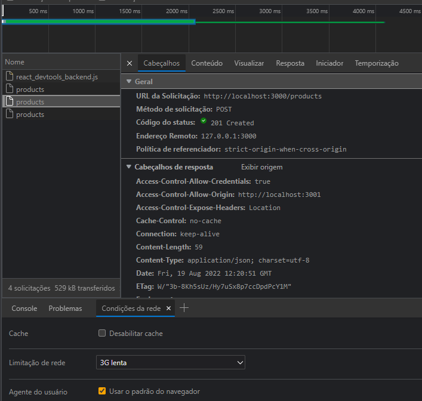
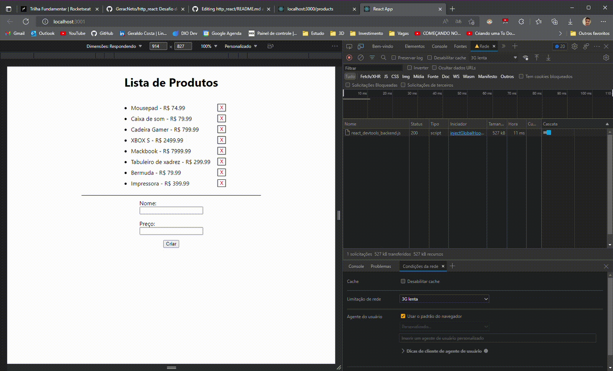
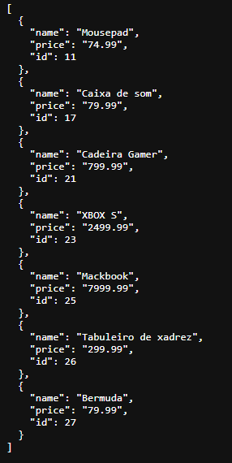
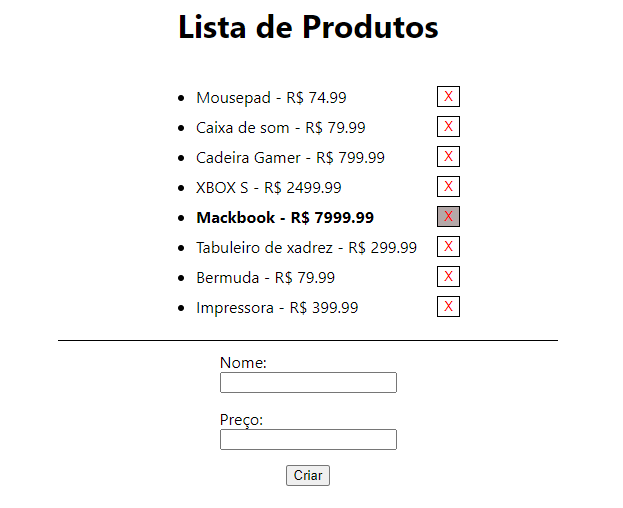

# Desafio do curso de React.js da Udemy

## Consumo de API simulada criada com json-server para requisições HTTP
### Para testes do projeto foi utilizado o software <a href="https://www.postman.com/">POSTMAN</a>

A aplicação gera uma lista de produtos de acordo com a criação deles pelo usuário. Essa criação é feita pelo método "POST" e em seguida a lista é exibida por meio do método "GET". Também é possível excluir itens da lista clicando nos botões de delete (X), essse faz uma requisição de "DELETE" com ID do item correspondente.

URL da API pelo json-server: http://localhost:3000/products

Obs: Para que a simulação seja mais próxima do real, altere as limitações de rede do app para **3G Lenta** no inspecionar da página conforme a figura abaixo. Além disso, deixe visível a opção de **Rede** no inspecinar para visualizar as requisições

## Config


<hr>

## GIF


## API


## Application


# Install
Clone this repository and install it dependencies with this command: 
```sh
$ npm install
```
# Running
Run the server with `npm run server` command, it will start the server. Then, run the application with `npm start` comand
```sh
$ npm run server
$ npm start
